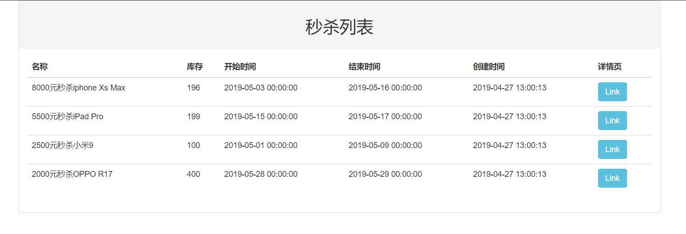
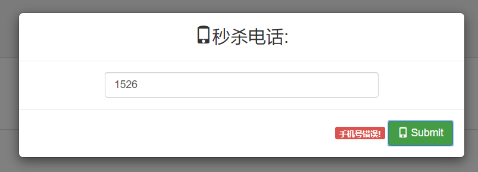
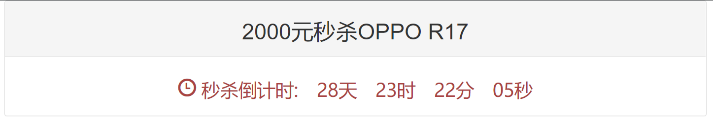
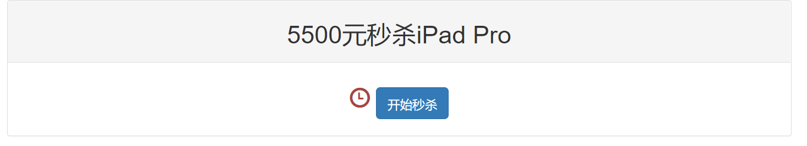
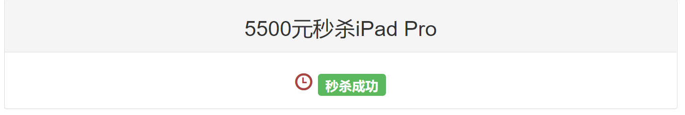
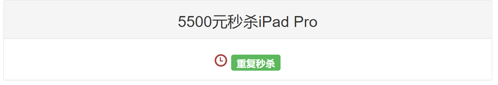
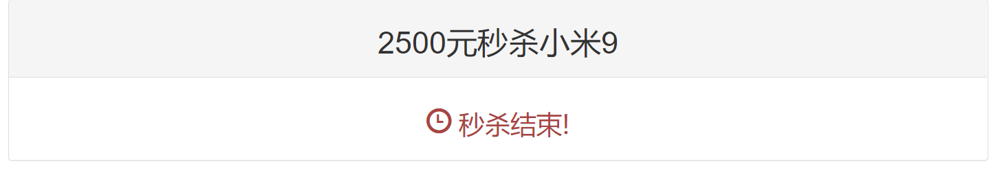

# Java 高并发秒杀系统 Seckill

## 项目介绍

 
 
 

 
 

本项目使用 SSM (SpringMVC+Spring+MyBatis) 框架开发高并发限时秒杀 web 应用。

### 功能介绍

- 系统首页是商品列表页，点击秒杀链接进入商品详情页；
 
- 进入详情页后，输入手机号进行简单的登录；
 
- 商品秒杀开启前，用户能看到商品秒杀倒计时，但不能进行秒杀；
 
- 商品秒杀开启时，可以进行秒杀，一个账号对同个商品只能秒杀一次；
 
 
 
- 商品秒杀结束后，显示商品秒杀已结束，阻止用户进行秒杀。
 

### 功能演示

## 特性

- 使用 SSM 框架开发后端业务，采用 RESTful 风格接口设计，并使用 JSON 交互数据；
- 使用 MD5 混淆秒杀链接，从而防止用户破解秒杀接口提前秒杀；
- 使用 Redis 缓存热点数据，减少对数据库的访问，提高页面响应时间；
- 使用存储过程执行秒杀操作，减少数据库行级锁时间，提高 SQL 语句执行速度；

## 开发技术

- 前端技术 ：Bootstrap + jQuery
- 后端技术 ：Spring + SpringMVC + MyBatis
- 依赖管理：Maven
- 版本控制：Git
- 数据库： MySQL + Redis
- 服务器： Tomcat

## 改进方向

UI美化，实现比较完整的注册登录功能，增加商户客户端